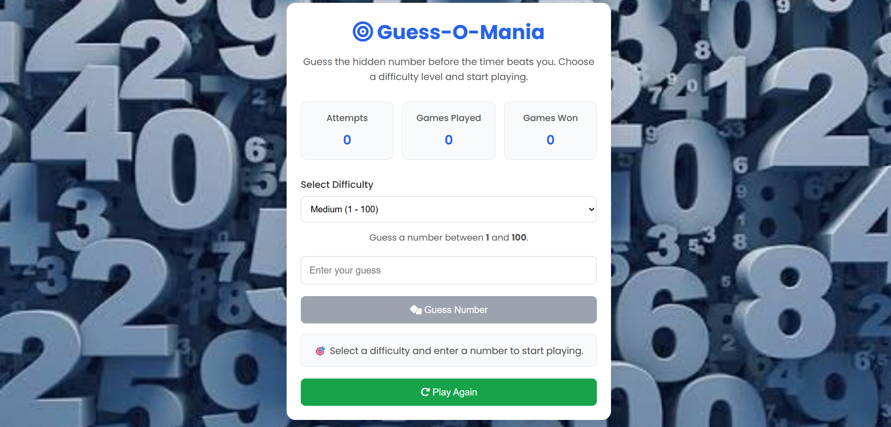
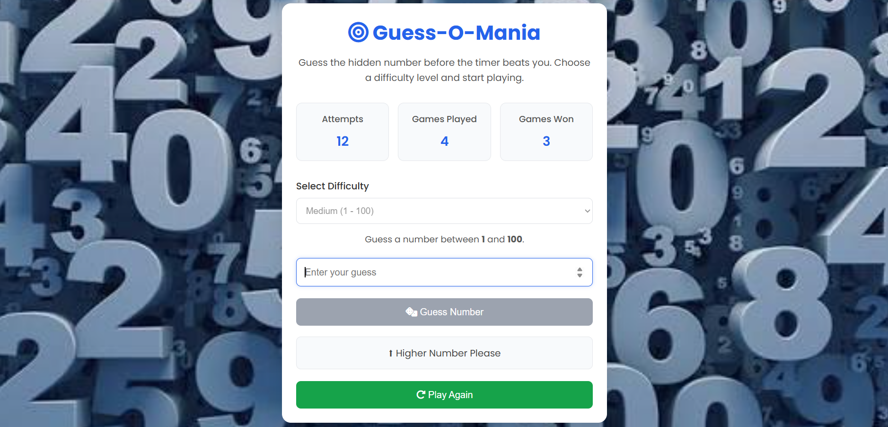
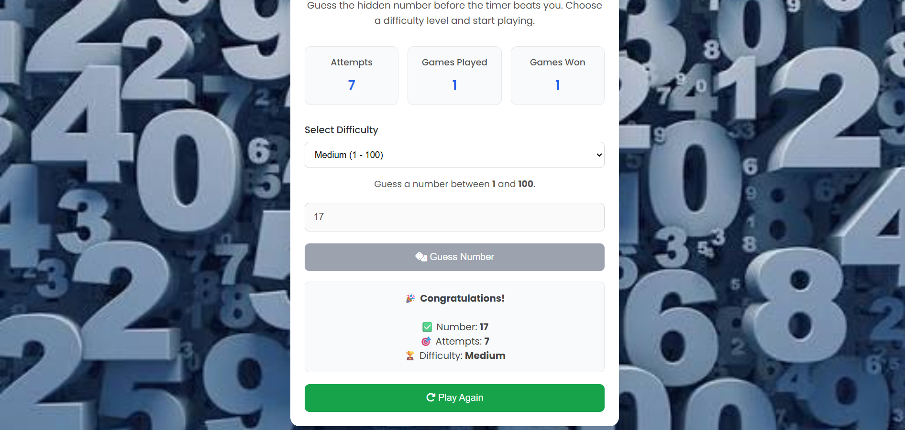

# 🎯 Guess-O-Mania

<p align="center">
  
  
  
  
  
  
</p>

<h3 align="center">
🎲 Guess Smart • Think Fast • Beat Your Best Score
</h3>

<p align="center">
Guess-O-Mania is an interactive browser-based number guessing game developed using HTML, CSS, and JavaScript. Players choose a difficulty level and try to guess a randomly generated number with the help of higher/lower hints. The project demonstrates JavaScript DOM manipulation, event handling, timers, local storage, and responsive web design through a clean and engaging user interface.
</p>

---

# 📚 Table of Contents

- Features
- Tech Stack
- Technical Highlights
- Project Preview
- Game Workflow
- Project Structure
- Installation
- Future Enhancements
- Learning Outcomes
- About the Developer
- License

---

# 📌 Features

- 🎯 Random Number Generation
- 🎚️ Multiple Difficulty Levels
- ⬆️ Higher / Lower Hints
- 🔢 Attempt Counter
- ⏱️ Live Timer
- 🏆 Best Score Tracking
- 📊 Games Played & Games Won Statistics
- 📈 Win Rate Calculation
- 💾 Best Score Saved using Local Storage
- ⌨️ Enter Key Support
- ✅ Input Validation
- 🔄 Restart Game
- 📱 Responsive User Interface

---

# 🛠️ Tech Stack

| Category | Technologies |
|----------|--------------|
| Frontend | HTML5, CSS3, JavaScript |
| Storage | Browser Local Storage |
| Version Control | Git & GitHub |

---

# 🚀 Technical Highlights

- JavaScript DOM Manipulation
- Event Handling
- Random Number Generation
- Conditional Logic
- Input Validation
- Timer using `setInterval()`
- Local Storage Integration
- Dynamic UI Updates
- Responsive Web Design

---

# 📸 Project Preview

## 🎮 Home Screen

<p align="center">

</p>

---

## 🎯 Gameplay

<p align="center">

</p>

---

## 🏆 Winning Screen

<p align="center">

</p>

> **Note:** Replace the screenshot filenames with your actual image names after adding them to the `Screenshots` folder.

---

# 🔄 Game Workflow

```text
Start Game
      │
      ▼
Select Difficulty
      │
      ▼
Generate Random Number
      │
      ▼
Enter Guess
      │
      ▼
Check Guess
      │
      ├──────────────┐
      ▼              ▼
Too Low          Too High
      │              │
      └──────┬───────┘
             ▼
Guess Again
             │
             ▼
Correct Guess
             │
             ▼
Show Attempts, Timer & Best Score
             │
             ▼
Play Again
```

---

# 📂 Project Structure

```text
Guess-O-Mania/
│
├── index.html
├── style.css
├── script.js
├── Screenshots/
├── README.md
└── LICENSE
```

---

# ⚙️ Installation

Clone the repository

```bash
git clone https://github.com/AkshaykumarSanti/Guess-o-Matic.git
```

Move into the project directory

```bash
cd Guess-o-Matic
```

Open the project

```text
Open index.html in your browser
```

Or use the VS Code Live Server extension for a better development experience.

---

# 🚀 Future Enhancements

- 🌙 Dark Mode
- 🔊 Sound Effects
- 🎖️ Achievement System
- 🌐 Online Leaderboard
- 🎨 Theme Selection
- 📱 Progressive Web App (PWA)
- 🎵 Background Music
- 🧠 Hint System

---

# 📚 Learning Outcomes

Through this project, I gained practical experience in:

- HTML5 Semantic Structure
- CSS3 Responsive Design
- JavaScript Fundamentals
- DOM Manipulation
- Event Handling
- Conditional Statements
- Random Number Generation
- Timers using `setInterval()`
- Browser Local Storage
- Input Validation
- Git & GitHub Version Control

---

# 👨‍💻 About the Developer

## Akshaykumar Santi

🎓 Bachelor of Engineering (Computer Science & Engineering)

🎯 CGPA: **9.15**

💻 Aspiring Software Developer passionate about Python, Django, JavaScript, SQL, and Full-Stack Web Development.

### Technical Skills

- Python
- Django
- JavaScript
- SQL
- HTML5
- CSS3
- Git
- GitHub

Currently improving Data Structures & Algorithms while building real-world software projects.

---


<p align="center">

⭐ If you found this project useful, consider giving it a Star.

Made with ❤️ using HTML, CSS & JavaScript.

</p>
